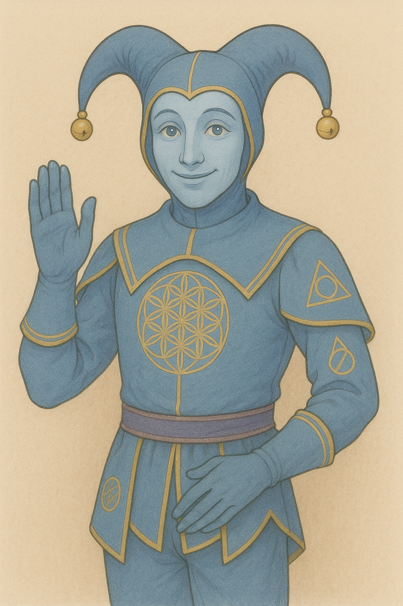

# 📘 *The Collective Individual*  
### *A Book on Rational Agency, the Meta Frame, and the Emergent Self*

---

## 🌱 Overview

**The Collective Individual** is a long-form philosophical work exploring:

- Rational Agency (i.e., Proportionality and the Limited Will)
- Context → Identity → Ethic  (An articulated Contextual Framework shapes Identity and Ethic in tandem )
- Frames and Games (two sides of the same coin; frame implies game)
- The Meta Frame and Meta Game (Perfection against the Mundane) 
- The structure of Selection (authentic[ating] selection is Limited Will as extension of the Universal Will)
- Self Generation (Individual Self & Universal Self)

Core Question:

### **How does a rational agent act with intention such that their own becoming becomes real, elevated, and self-reifying?**

This book presents a framework for inhabiting what is called **the divine frame** — a style of being that approximates the Meta Frame and reveals deeper structure in both mind and world.

It is impossible to *fully* inhabit the Meta Frame (it is asymptotic, like a limit),  
but it is always possible to **approximate it more faithfully.**

---

## 🧩 Core Philosophical Premises

This book is written for readers who intuit that:

- Reality is fundamentally two-sided  
- Reality is **That Which Selects**  
- And *you*, too, are **That Which Selects**  
- Identity emerges from reciprocation between world and will  
- The mind is a **mirror**  
- The inside and outside are co-terminous  
- Personalities “out there” become resonant “in here”  
- Every moment is a **game** — a bounded circumstance with skill, competence, and consequence  
- Skills have **cross-domain synergy**, enabling endless development  
- The Individual may **transmute the mundane** into the transcendental  
- This transformation occurs through internalizing and applying the **Meta Frame**

### The Limited Will  
A central concept:

> **Rational Agency presumes ownership of a Limited Will — the reach that pushes away.**

You are shaped by your environment,  
yet you perturb it.  
Therefore, you are (in part) a product of your own perturbations.

To *exercise* the Limited Will is to *un-limit* it.

---

## 🧭 Structure of the Manuscript

The book is organized into the following parts:

1. **Preface**  
2. **On Language**  
3. **Frames and Games**  
4. **The Metaphysic**  
5. **Primordial Frames**  
6. **Rational Agency**  
7. **The Meta Frame and the Meta Game**  
8. **Mastery of the Meta Game**

Each chapter exists as a directory within:

```
manuscript/
```

with an `index.md` file holding principal content.

All builds (PDF & EPUB) are handled through Pandoc; see below for details.

---

## 🔧 Repository Structure

```
the-collective-individual/
│
├── manuscript/
│   ├── 00-frontmatter/
│   │   ├── title-page.md
│   │   └── preface.md
│   ├── 01-on-language/
│   ├── 02-frames-and-games/
│   ├── 03-the-metaphysic/
│   ├── 04-primordial-frames/
│   ├── 05-rational-agency/
│   ├── 06-the-meta-frame-and-meta-game/
│   ├── 07-mastery-of-the-meta-game/
│   └── 99-backmatter/
│
├── assets/img/
│   └── si-cover.png
│
├── build/
│   └── pandoc/
│       └── metadata.yaml
│
├── scripts/
│   └── build-book.sh
│
├── SUMMARY.md
├── MANIFEST.md
└── VERSIONING.md
```

---

## 🛠️ Building the Book (PDF & EPUB)

This project uses **Pandoc** + **LaTeX** (via MacTeX) to build the manuscript.

From the repo root:

```bash
./scripts/build-book.sh
```

You will find output in:

```
dist/the-collective-individual.pdf
dist/the-collective-individual.epub
```

The title page includes **Si the Jester**, and the EPUB uses Si as the official cover.

---

## 🎨 Editor & Terminal Theme

This repo includes a fully custom, hand-crafted **VS Code theme** inspired by Si’s palette:

- Parchment background  
- Si blue for structure and types  
- Gold for keywords & highlights  
- Soft accents from desert + sky tones  

For installation instructions, see:

```
si-the-jester-theme/
```

---

## 👤 About the Symbolism of Si

Si the Jester functions as a guide — not a mascot.  
He is the archetype of:

- Playful wisdom  
- Friendly orientation  
- Honest reflection  
- Symbolic mirroring  
- The joyful pursuit of the Meta Frame  

He is present throughout this project as both a visual anchor and a metaphoric character representing **the rational agent in the process of self-elevation.**

---

## 📘 License & Contributions

This is a **personal philosophical manuscript**, and contributions are not open at this time — however, feedback and discussion are welcome.

---

## 🌞 Final Note

This book is a work of **orientation**.  
It is not simply a philosophy; it is a *method* — a way of moving through the world with increasing clarity, intentionality, and self-authored momentum.

> *To inhabit the Meta Frame is to participate willingly in the ever-unfolding elevation of the self.*

Thank you for reading, building, and journeying.

<br>



**Si the Jester — Guide of Orientation**  
*A symbolic companion throughout this project.*